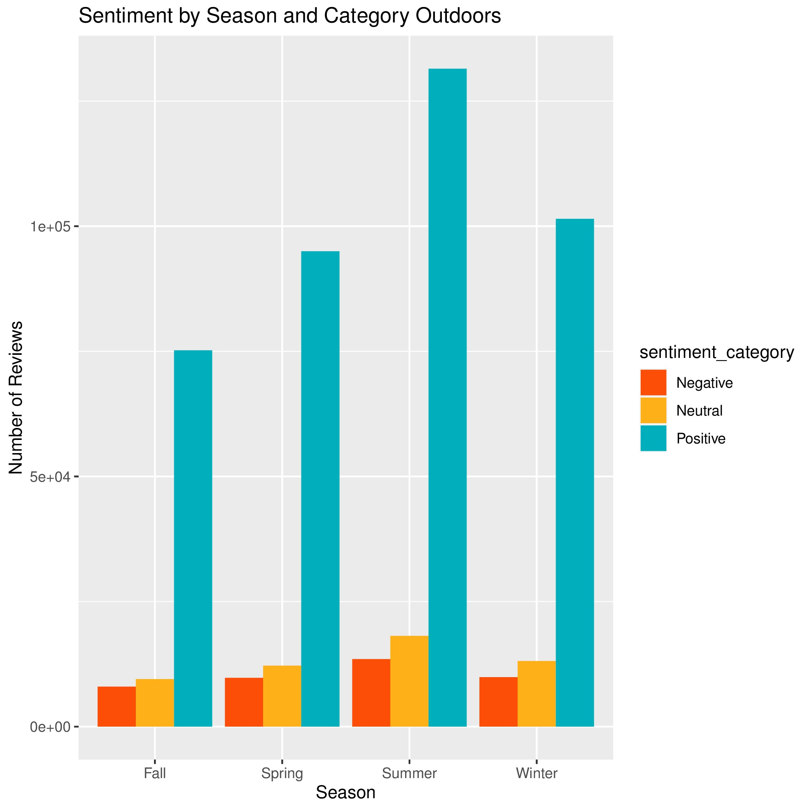
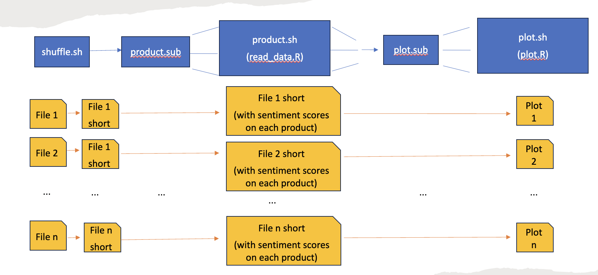

```{r echo=FALSE, warning=FALSE, include=FALSE}
library(knitr)
library(tidyverse)
```

## Github
https://github.com/cwu377/Group4_STAT405 

# Introduction
The aim of this project is to analyze the sentiment of customer reviews by season for different categories on Amazon. Amazon’s influence in the e-commerce world is ubiquitous, and customer reviews play an important role in influencing consumer decisions in today’s e-commerce landscape. Analyzing the sentiment of these reviews can offer a deeper understanding of how customer perceive products in each category. The dataset used for this analysis is the [Amazon Customer Reviews Dataset](https://www.kaggle.com/datasets/cynthiarempel/amazon-us-customer-reviews-dataset), consisting of a wide array of reviews spanning from 1995 — 2015.    
Here is the structure of this report:    

i. We explain our motivations for the research question by doing some exploratory data analysis.     
ii. We demonstrate how we implement and broadcast our analysis using CHTC.     
iii. We formally answer our research question: **How do customer reviews on Amazon for different product categories vary by sentiment across different seasons?**     
iiii. Conclusion    
v. For simplicity of this report, we only demonstrate results for a single category. However, you can find results for other categories in our google drive. (14 in total)    
vi. Contributions
 
# Preliminary Data Exploration
To start off, we computed some basic statistics on the data. Firstly, we calculated the average sentiment of all the reviews. The average sentiment across all seasons was found to be 4.96 with a standard deviation of 6.10 which indicates a lot of variance in sentiment across the different reviews for the 4 seasons. This suggests that most reviews in the dataset were positive in connotation (positive values denote positive reviews, and so on).     
Further, we examined the distribution of sentiment across seasons. We created a histogram to show the counts of reviews for the 3 different sentiments (positive, neutral, negative) across different seasons for a category of products to show customer satisfaction varying by season.     
```{r echo=FALSE, warning=FALSE}
outdoor_df <- read_csv("report_materials/df_result_amazon_reviews_us_Outdoors_v1_00.tsv.short.tsv.csv", 
                       col_types=cols())
```



We also created a box plot of the sentiment by season, which revealed some interesting patterns.    
```{r echo=FALSE, warning=FALSE}
means <- aggregate(sentiment ~  season, outdoor_df, mean) %>%
  mutate(sentiment = round(sentiment,2))
ggplot(outdoor_df, aes(x = season, y = sentiment)) +
  geom_boxplot() +
  stat_summary(fun=mean, colour="darkred", geom="point", 
               shape=18, size=3, show.legend=FALSE) +
  geom_text(data = means, aes(label = sentiment, y = sentiment), 
            hjust=-0.3, vjust=-0.7)
```
This suggests that there may be little seasonal variation in customer satisfaction, which could be due to a variety of factors such as weather conditions or holiday shopping patterns. In the statistical methods section, we will conduct further statistical analysis to explore this relationship in more detail.

# Computational Steps

We use a product.dag program to complete our product.     

* First, the product.dag runs the shuffle.sh program, the shuffle.sh can take a partial section of each file, we do this to fit memory constraints in CHTC.     
* Then we run the product.sub, this program can run 14 read_data.R programs in parallel. We use read_data.R to compute the sentiment score for each product.     
* Finally, we run the plot.sub, this program can run 14 plot.R programs in parallel. The plot.R can produce sentiment scores grouped by sentiment positivity and season.        

### Problems we ran into and solution
We attempted to run our whole dataset (approx 15 GB worth) with the 2 R scripts. We requested 5GB of memory from the CHTC machine on our preliminary run.    
We had 14 jobs sent to CHTC to be initiated and all of them were put on hold after about 1 hour of attempting to run the code, indicating a memory exceeded limit exception. We increased the memory incrementally (by about 5-10 GB per run) to about 60 GB.    
The job still took a long time to run (> 1 hour) while also returning incomplete or empty results.
Solution:    

* We sampled/shuffled our input files in sizes of 50% of the average initial size (500000
rows from 1000000 rows (averaging 0.7-1GB each)). We also made sure to select solely the columns necessary for our analysis.    
* After these modifications, we got significant results that we believed could be extended to the bigger dataset with acceptable runtime.    


# Statistical Methods
We denote global mean of sentiment scores to $\mu$, and sentiment mean of spring, summer, fall, winter to $\mu_1$, $\mu_2$, $\mu_3$, $\mu_4$, respectively.     
There are our 2 statistical methods:

* ANOVA with null hypothesis: $\mu_1=\mu_2=\mu_3=\mu_4$
* We compare 4 seasons' means to the global mean separately. i.e. null hypothesis is $\mu_i=\mu, for\ i=1,2,3,4$


To illustrate our statistical methods, we will use the outdoor category as the example.

```{r echo=FALSE, warning=FALSE}
anova_df <- read_csv("report_materials/anova_df_result_amazon_reviews_us_Outdoors_v1_00.tsv.short.tsv.csv.csv",
                     col_types=cols())
kable(anova_df, caption="ANOVA (Outdoors Category)")
```
According to the result of ANOVA, we reject the null hypothesis that the means are consistent across the various seasons in the outdoor category. In other words, at least two seasons' means are different.      
To better understand how each season's mean compare to the global mean, we further conduct the t-test for each season's mean versus global mean, separately.    

```{r echo=FALSE, warning=FALSE}
anova_df <- read_csv("report_materials/ttest_df_result_amazon_reviews_us_Outdoors_v1_00.tsv.short.tsv.csv.csv",
                     col_types=cols())
kable(anova_df, caption="T-Test (Outdoors Category)")
```
By the above table, we observe that spring and summer's sentiment scores are differ from the global mean.   
This may help a company by giving them an insight into possibly how their pricing strategies work during the spring and summer, and they could offer more discounts during other periods to achieve the same during other seasons.    

# Conclusion
With the computational capabilities of the parallel computing tool(CHTC), we can easily broadcast the above analysis to other categories. Therefore, the stakeholder can formulate and customize their sell strategies for all categories.


# Supplement Materials
We have 14 categories in total, and each one has corresponding plot, ANOVA, t-test, short_csv.     
Please find results for other category in the link: https://drive.google.com/drive/folders/1REOv_ipn2x12cZzSPlBugKHUZ-62D-tv?usp=sharing 

# Contribution
```{r echo=FALSE, warning=FALSE}
contri_df <- data.frame("Member"=c("Rohit Poduri", "Chao-Sheng Wu", "Shichen Gao", "Yubing Zhan"), 
                'Proposal'=c(1,1,1,1), 
                "Coding"=c(1,1,1,0.9), 
                "Presentation"=c(1,1,1,1), 
                "Report"=c(1,1,1,1))
kable(contri_df, caption="Contribution")
```


